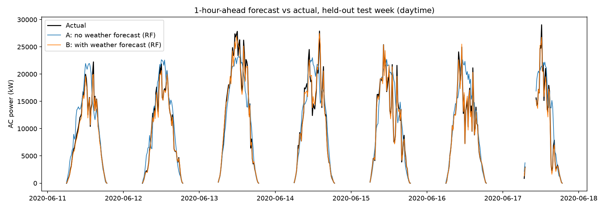
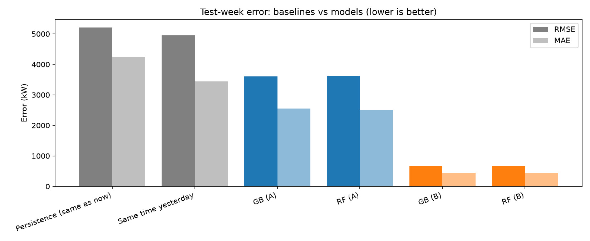
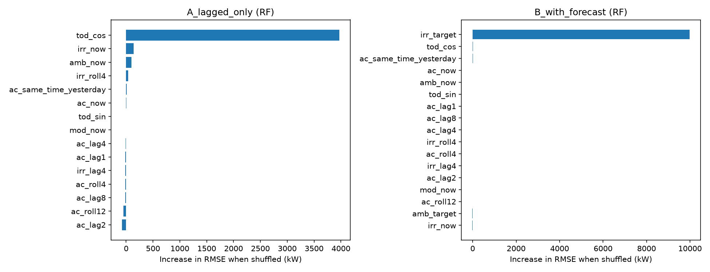

# Short-Term Solar Power Forecasting

One-hour-ahead forecasting of solar plant output from 15-minute generation and weather-sensor data, using lagged features with Random Forest and Gradient Boosting, evaluated on a held-out future week.

## Summary

- **Task:** at any time *t*, predict the plant's total AC power at *t* + 1 hour.
- **Data:** 34 days of 15-minute generation and weather-sensor data from one solar plant (Kaggle).
- **Models:** Random Forest and Gradient Boosting, compared with two naive baselines.
- **Validation:** strictly chronological. Train on the first ~26 days, test on the last 7 days. No shuffling.
- **Main result:** without any weather forecast, the models reduce error by about 27% against the best naive baseline (same time yesterday). With a perfect weather forecast, error falls a further ~82%.

| Setup | Best RMSE (kW) | RMSE as % of mean power |
|---|---|---|
| Persistence baseline | 5,212 | 46.7% |
| Same-time-yesterday baseline | 4,952 | 44.3% |
| **A:** generation and weather history only | 3,606 | 32.3% |
| **B:** A + weather at the forecast time (perfect-forecast upper bound) | 664 | 5.9% |

## Background

This project rebuilds an earlier course project that compared Linear Regression and Random Forest on a yearly, country-level energy dataset with a random train/test split. That setup cannot answer a forecasting question, because the model sees the future during training. This version reframes the problem as true time-series forecasting: the model may only use information available at forecast time.

## Data

- **Source:** [Solar Power Generation Data](https://www.kaggle.com/datasets/anikannal/solar-power-generation-data) by Ani Kannal on Kaggle (two plants, generation and weather-sensor files).
- **Used here:** Plant 1, 15 May to 17 June 2020 (3,264 timesteps of 15 minutes). Plant 2 is not used in the reported results.
- **Signals:** AC power summed over the plant's 22 inverters; irradiation, ambient temperature and module temperature from the weather sensor.
- **Not included in this repo.** Download the four CSVs from Kaggle and set the `RAW` path at the top of `dataprocessing.ipynb`.

## Method

**1. Cleaning** (`dataprocessing.ipynb`, `datacleaning.ipynb`)
- Inverter-level rows are summed to one plant-level value per timestamp, and the merge is done on a complete 15-minute grid so gaps stay visible.
- In 101 timestamps fewer than all 22 inverters reported, which makes the summed power look like a false drop. In total about 6% of timestamps (207) had missing or unreliable generation. These rows are excluded from training and evaluation. The target is never filled in.
- Weather gaps of up to one hour are interpolated. Longer gaps are left missing and those rows are dropped.

**2. Exploratory analysis** (`EDAcheck.ipynb`): daily cycle, outage timeline, power vs irradiation (`figures/eda_*.png`).

**3. Features and target** (`features.ipynb`)
- **Target:** AC power 4 steps (1 hour) ahead.
- **Generation features:** current power, lags at 15, 30, 60 and 120 minutes, the value at the target time one day earlier, and 1-hour and 3-hour rolling means.
- **Weather features:** irradiation, ambient and module temperature observed up to now, an irradiation lag and rolling mean.
- **Time of day** of the target, encoded as sine and cosine.
- **Only daytime targets** (06:00 to 19:00) are kept. Night output is zero and would flatter every metric.

**Why lagged features?** Random Forest and Gradient Boosting treat each row as independent and have no notion of time order. To forecast, the recent past has to be supplied as columns: yesterday's value, the last hour's average, the latest irradiation. The same table design also makes sure no feature uses information from after the forecast time.

**4. Two setups**
- **A (lagged only):** every feature is known at forecast time. This is a real forecast with no external inputs.
- **B (with weather forecast):** A plus irradiation and ambient temperature at the target time. This assumes a weather forecast is available. Here the *measured* values stand in for the forecast, so B is an **upper bound**: real forecasts have their own errors.

**5. Split and tuning** (`train.ipynb`)
- Train: forecasts whose target falls before 11 June (1,152 rows). Test: 11 to 17 June (349 rows). Forecasts whose target falls inside the test week are excluded from training as a safeguard (none are affected here, since those hours are at night and already removed by the daytime filter).
- Hyperparameters are tuned with chronological 4-fold `TimeSeriesSplit` on the training rows only. No feature scaling (tree models).
- In the plots, the model shown for each setup is the one with the lower cross-validation score, not the lower test score.

**6. Baselines:** *persistence* (forecast = current power) and *same time yesterday*.

## Results (7-day held-out test week, daytime, 349 forecasts)

| Setup | Model | RMSE (kW) | MAE (kW) | RMSE % of mean power | Skill vs persistence |
|---|---|---|---|---|---|
| Baseline | Persistence | 5,212 | 4,245 | 46.7% | 0.00 |
| Baseline | Same time yesterday | 4,952 | 3,440 | 44.3% | 0.05 |
| A | Gradient Boosting | 3,606 | 2,548 | 32.3% | 0.31 |
| A | Random Forest | 3,632 | 2,509 | 32.5% | 0.30 |
| B | Gradient Boosting | 667 | 443 | 6.0% | 0.87 |
| B | Random Forest | 664 | 440 | 5.9% | 0.87 |

Skill = 1 − RMSE / RMSE(persistence). Mean test-week daytime power is about 11,170 kW.





**What the results show**
- Without any weather forecast (A), both models beat both baselines. The forecasts follow the daily cycle well but overshoot when clouds arrive suddenly, because sudden dips cannot be predicted from recent power alone.
- A good weather forecast is worth a lot. Setup B cuts the error by about 82% relative to A. Permutation importance shows B relies almost entirely on irradiation at the target time, consistent with the near-linear power-to-irradiation relationship seen in the EDA.
- In A, time of day dominates the importance plot. The lag and rolling features are strongly correlated with each other, so shuffling any one of them barely changes the error. This does not mean they are useless.
- Random Forest and Gradient Boosting are practically indistinguishable here (RMSE differences under 1% in both setups). No winner is claimed.
- Test errors are in line with cross-validation errors, which is consistent with no leakage between train and test.
- The gap in the forecast plot on 17 June is excluded outage data.

## Limitations

- **Short window:** 34 days of one plant, with no seasonal variation. Results may not transfer to other seasons or sites.
- **Small test set:** seven days, a single test period, no confidence intervals. Rows are 15 minutes apart and highly correlated, so the effective sample is closer to a few dozen days than 1,500 rows.
- **Setup B is an upper bound**, as it uses measured rather than forecast weather.
- **One horizon:** only 1 hour ahead. Day-ahead forecasting is harder and is not evaluated.
- About 6% of timestamps were excluded because of inverter outages or missing data.
- Only light hyperparameter tuning was done, and some best values sit at the edge of the search grid.

## Next steps

- Replace measured weather in setup B with real numerical weather forecasts (for example from NASA POWER or a forecast API) to get a realistic estimate.
- Sequence models (LSTM or Transformer) as a natural next step once more data is available.
- Longer data, covering seasons, and a Japanese site, to test generalisation. Plant 2 from the same dataset is a quick first check.
- Multiple horizons, and prediction intervals instead of single-value forecasts.

## Repository structure

```
dataprocessing.ipynb   load, aggregate and merge generation and weather
datacleaning.ipynb     exclude unreliable rows, fill short weather gaps
EDAcheck.ipynb         exploratory plots
features.ipynb         lag features, target, chronological split
train.ipynb            Random Forest and Gradient Boosting, time-series CV
test.ipynb             baselines, test-week metrics, result figures
figures/               EDA and result plots
```

## How to run

1. Download the four CSVs from Kaggle and set the paths at the top of each notebook.
2. Run the notebooks in this order: `dataprocessing`, `datacleaning`, `EDAcheck`, `features`, `train`, `test`.
3. Requirements: Python 3, pandas, numpy, scikit-learn, matplotlib, joblib.

## Author

Arqia M, Universitas Gadjah Mada
